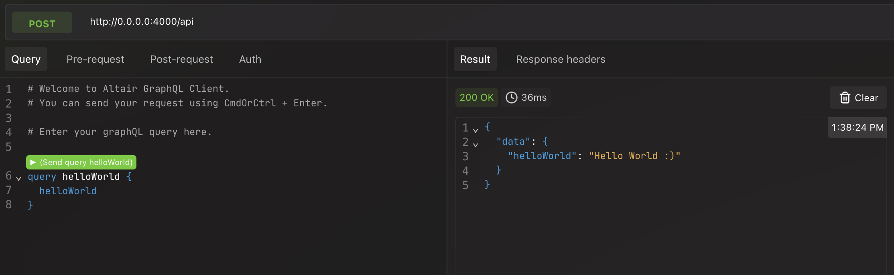

# Backend Recruitment Test

This is the `backend` boilerplate for the test to join the Hubs Contabilidade Technology Team. Welcome!

The purpose of this test is to assess your logical reasoning ability, as well as your back-end coding skills, structuring relationships between entities, system integrations, code organization, creativity, independence, and problem-solving.

## The challenge

A customer has requested a very simple `enterprises` management system. Your role is to structure a CRUD-type interface that allows `enterprises` to be retrieved, registered, modified and removed from the system. Once this structure is complete, integrate the system with a simple `frontend` application. You will find the `frontend` boilerplate [here](here).

### Important notes

- The `enterprise` entity must have at least one relationship with a second entity of your choice;
- To make the process easier for you, we have provided a `migration` and a `schema` that represent the base `enterprise` entity;
- The application is configured to serve information using `GraphQL` through the `Absinthe` plugin. The entire API interface must be built in the same way.

### What will be evaluated

- The overall organization of your code;
- The technical level of the implementation;
- The level of creativity of the implementation.

> Please keep in mind that we’re not evaluating whether you can build up an application with a million complex features. Do what you can within your available time. However, remember that the more things you can show, the more points your test will potentially earn.

### What we don't recommend doing

- Asking someone to code your test for you;
- Using code generated by AI like ChatGPT or Gemini (we want to evaluate your skills, not the AI's);
- Changing the scope of the project too much.

### What we would like to see (but it is not mandatory)

- Unit and E2E tests;
- Using asynchronous jobs and/or queues to handle stuff;
- Audit logs.

If you're struggling, read the documentation for [Elixir](https://hexdocs.pm/elixir/1.18.1/introduction.html), [Phoenix](https://hexdocs.pm/phoenix/Phoenix.html), [Absinthe](https://hexdocs.pm/absinthe/), and [Ecto](https://hexdocs.pm/ecto/Ecto.html). You will find many answers there (I mean really, these docs are top tier).

The rest is up to you! Good luck!

## General instructions

> To run this test, we assume you already have `Docker`, `Elixir` and some `DBMS` installed on your machine. If not, you'll need to figure out how to set this up yourself first.

To start your `Phoenix` server:

- Run `docker-compose up database` to setup the database container;
- Run `mix setup` to install and setup dependencies, and to run the available migrations;
- Start the application endpoint with `mix phx.server` or inside IEx with `iex -S mix phx.server`;
- Load the database dump available at `assets/dump.sql` to your local database;
- Now you can consume the API through [`localhost:4000`](http://localhost:4000) from your preferred GraphQL client.

